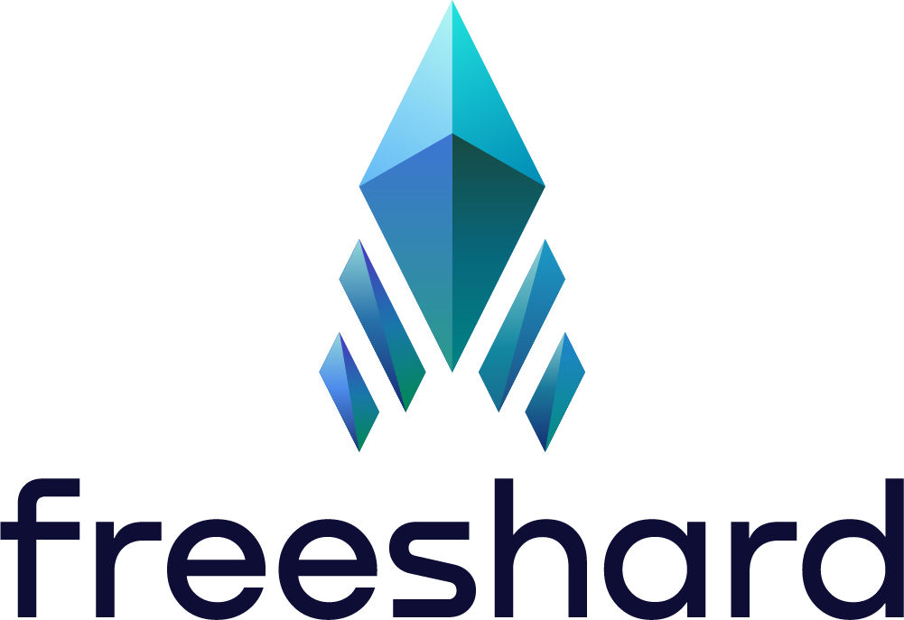

<p align="center">
<picture>
    <source media="(prefers-color-scheme: dark)" srcset="readme/Freeshard_logo_for_dark.png">
    <source media="(prefers-color-scheme: light)" srcset="readme/Freeshard_logo_for_light.png">
    
</picture>
</p>

> [!NOTE]
> Freeshard used to be called _Portal_. Don't be confused if you see the old name in the code or documentation.
> Our goal is to update everything as soon as possible.

# Web Terminal

Each Shard is controlled by one or multiple terminals, trusted devices that have been paired with the Shard.
This terminal comes in the form of a web application.

## Project setup
```
npm install
```

Compiles and hot-reloads for development
```
npm run serve
```

Compiles and minifies for production
```
npm run build
```

Lints and fixes files
```
npm run lint
```

## Development setup

### Develop with a real Shard

1. Create a Shard if you don't have one yet (e.g. at [trial.getportal.org](https://trial.getportal.org/))
2. Enter its domain as the proxy target in `vue.config.js`
3. Make sure that the `pathRewrite` option is disabled
4. Start the proxy together with the hot-reloading server with `npm run serve`

### Using shard_core running on the dev machine

1. Start shard_core, look for instructions in its readme on how to do that
2. Make sure that `http://127.0.0.1:8000` is the proxy target in `vue.config.js`
3. Make sure that the `pathRewrite` option is enabled
4. Start the proxy together with the hot-reloading server with `npm run serve`
5. Get a pairing code at http://127.0.0.1:8000/protected/terminals/pairing-code
